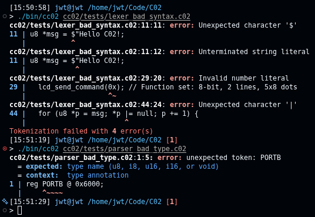

<div align="center">
 
  <picture>
    <source media="(prefers-color-scheme: dark)" srcset="./docs/logo-dark.png">
    <source media="(prefers-color-scheme: light)" srcset="./docs/logo-light.png">
    
  </picture>

  Strongly typed, C-like systems programming language built for resource-constrained 8-bit microprocessors.
  
  [](https://github.com/jackwthake/C02/actions/workflows/ci.yml)
</div>


## Getting Started: Key Features & Architecture

#### cc02 Compiler

1. **Source Tracking Tokenizer:** Maps characters to discrete tokens while maintaining source locations (file, line, column) for robust compilation errors.
2. **Recursive Descent Parser:** Transforms the token stream into a structured AST, treating hardware registers and standard controls as first-class grammatical constructs.
3. **Lexically Scoped Semantic Analyzer:** Implements a type synthesizer and validation engine. It enforces a hierarchical symbol table structure to handle block scoping (`if/else`, `while`, `for`), tracking variable lifetimes, validating function signatures, and trapping type mismatches before code generation.
> To be implemented!!
5. **Optimized Code Generator:** Generates valid 65C02 binaries. It avoids slow stack execution by mapping parameters and expression scratchpads directly onto a high-performance zero-page register design.
> To be implemented!!

#### c02-objdump Disassembler

- **Disassembler:** Decodes compiled `.bin` files back into annotated 65C02 assembly, resolving jump targets to named labels for readability. See [c02-objdump](c02-objdump/) for more information.

## Toolchain Usage

### Compiling the Toolchain

```shell
sudo apt install build-essential curl -y

# Official Rust install script
curl --proto '=https' --tlsv1.2 -sSf https://sh.rustup.rs | sh

git clone https://github.com/jackwthake/C02.git
cd C02
make
```

### Running the Compiler

```bash
cc02 [OPTIONS] <FILE>
```

#### Options

- `<FILE>`:               The input source file (.c02).
- `-h, --help`:           Show help message
- `--token-dump`:         Dump the token list after tokenization
- `--ast-dump`:           Dump the AST using print_ast after parsing
- `--syntax-check-only`:  Stop after syntax and semantic checks
- `--time-report`:        Prints a report showing how long each stage of compilation took
- `-o, --output`:         Specify output file

**Compile with:**

```bash
cc02 hello_world.c02 -o hello_world.bin
```

This will produce a binary with the above hello world program in `hello_world.bin`

### Pretty Error Messages



All generated error messages are presented in a clang like format with concise source locations. The printed file locations use an editor-friendly format, enabling you to click to open the affected file.

---

## Language Specifications

> The grammar below reflects what the tokenizer and parser currently accept. Semantic analysis and code generation are not implemented yet, so none of this is type-checked or compiled to 65C02 yet — see [Getting Started](#getting-started-key-features--architecture) above.

### Basic Types

- `u8` / `i8`: 8-bit integers (unsigned / signed)
- `u16` / `i16`: 16-bit integers (unsigned / signed)
- `void`: Function return types with no payload.
- `struct` names: a bare identifier in type position resolves to a struct type (e.g. `Point p;`).
- Pointer types: any base type followed by one or more `*` (e.g. `u8 *msg`, `u16 **pp`).

### Comments

```c
// single-line comment

/*
  block comment
*/
```

### Top-Level Declarations

A `.c02` file is a sequence of top-level declarations: functions, `reg` declarations, `struct` declarations, and global variables.

#### Functions

```c
fn name(u8 a, u16 *b) -> void {
  // body
}
```

- Parameter list is `(type name, type name, ...)`, can be empty: `()`.
- Return type is required, introduced with `->`.

#### Registers (`reg`)

Hardware interface registers are pinned directly to absolute memory addresses.

```c
reg u8 PORTA @ 0x6001;
reg u8 PORTB @ 0x6000;
```

#### Structs

```c
struct Point {
  u8 x;
  u8 y;
};
```

- Body is a sequence of `type name;` fields, no nested initialisers.

#### Global Variables

```c
u8 *msg = "Hello C02!";
u16 counter;
```

- Same form as a local variable declaration: `type name;` or `type name = expr;`.

### Statements

```c
// variable declaration (local)
u8 x = 5;

Point p;                      // struct-typed declaration
p = Point{ .x = x, .y = 10 }; // struct with initializer
p = Point{};                  // zero initialized struct

Point *p2; // or p2 = null;      pointer to a Point struct, uninitialized
Point *p2 = &p;               // pointer to a Point struct, initialized

// assignment (also: += -= *= /= %=)
x = x + 1;
x += 1;

// return
return;
return x;

// if / else if / else
if (x > 0) {
  // ...
} else if (true) { // `true` and `false` are accepted keywords
  // ...
} else {
  // ...
}

// while
while (x < 10) {
  x += 1;
}

// for (any of the three clauses may be empty)
for (u8 i = 0; i < 10; i += 1) {
  // ...
}

// function call statement
do_thing(a, b);
```

### Expressions

Precedence, lowest to highest:

```
||  &&  |  ^  &  ==  !=  <  >  <=  >=  <<  >>  +  -  *  /  %  (unary)  (postfix)
```

- **Unary (prefix):** `!` (logical not), `-` (negate), `&` (address-of), `~` (bitwise not), `++` / `--`, `*` and `@` (dereference).
- **Postfix:** `.field` field access, chainable (`a.b.c`).
- **Calls:** `name(arg1, arg2, ...)`.
- **Casts:** `(type)expr`, e.g. `(u16)x`.
- **Grouping:** `(expr)`.
- **Literals:** decimal/hex integers (`l_num`), string literals (`l_string`), identifiers.

### Compilation Example

```c
reg u8 PORTB @ 0x6000;
reg u8 PORTA @ 0x6001;
reg u8 DDRB @ 0x6002;
reg u8 DDRA @ 0x6003;

/*
 PORTB = LCD data lines
 PORTA = top 3 bits for control lines, PA7 = enable, PA6 = read/write, PA6 = register select
*/

u8 *msg = "Hello C02!";

fn lcd_send_command(u8 cmd) -> void {
  PORTB = cmd; // Put command on data lines
  PORTA = 0x80; // RS=0, E=1 to latch command
  PORTA = 0x00; // E=0 to complete command
}

fn lcd_putc(u8 ch) -> void {
  PORTB = ch; // Put character on data lines
  PORTA = 0x32; // RS
  PORTA = 0xA0; // RS | E
  PORTA = 0x32; // RS
}

fn main() -> void {
  // Set the data direction registers for PORTA and PORTB to output
  DDRB = 0xFF; // Set all pins of PORTB as output
  DDRA = 0xE0; // Set top 3 bits of PORTA as output (for RS, RW, E)

  // Clear the ports to start with a known state
  PORTB = 0;
  PORTA = 0;

  // Initialize the LCD (following a typical initialization sequence)
  lcd_send_command(0x38); // Function set: 8-bit, 2 lines, 5x8 dots
  lcd_send_command(0x0C); // Display on, cursor off
  lcd_send_command(0x06); // Entry mode set: increment cursor, no shift

  for (u8 i = 0; i < 10; i += 1) {
    lcd_putc(msg);
  }
}
```

---

### Zero-Page Hardware-Register Layout

To maximize compilation density and execution speed, the code generator reserves and maps lower RAM (`$0000–$00FF`, **The Zero Page**) to form a virtual register file:

| Address Range | Identifier | Purpose |
| :--- | :--- | :--- |
| **`$00`** | `FP` | **Frame Pointer:** Tracks multi-byte local variable frames in main RAM. |
| **`$02`** | `RET` | **Return Register:** Where every function or conditional puts its return value. |
| **`$04` – `$1D`** | `r0` – `r13` | **Virtual Registers:** General 16-bit high-speed scratchpads for nested expression evaluation. |
| **`$1E` – `$2F`** | `args0` – `args9` | **Function ABI Zone:** Rapid parameter passing into function bounds without stack overhead. |
| **`$30` – `$FF`** | `usr_space` | **User Space:** Globals and variable caching at the programmer's discretion. |

---